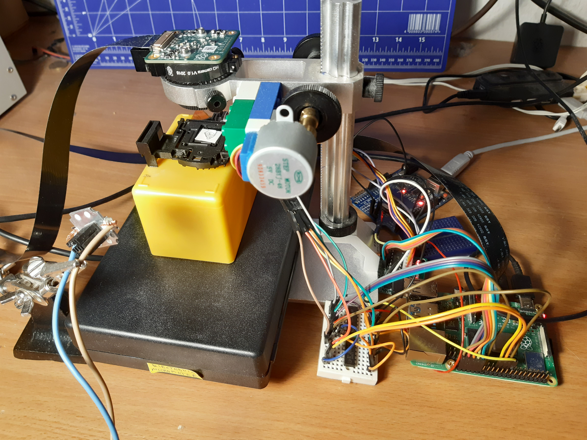

# pigpio-stepper-motor

I use 28BYJ-48 stepper motor (4096 steps) and ULN2003 driver. I connect to 6, 13, 19, 26 pins and control over pigpio using python3 on Raspberry Pi.

## Motor args
motor(pi, pin1, pin2, pin3, pin4, [sequence], [delayAfterStep])

* pi - pigpio.pi instance
* pin1, pin2, pin3, pin4 - pins has been connected to the driver
* sequence - halfStepSequence or fullStepSequence. Default sequence = halfStepSequence
* delayAfterStep - Delay after step. Default delayAfterStep = 0.0025 second
* pos - last position (allows to start exactly where stopped). Default 0.

## Examples
I connect driver to 6, 13, 19, 26 pins. I use 28BYJ-48 stepper motor (4096 steps in halfStepSequence, 2048 steps in fullStepSequence) and ULN2003 driver.

[keys_xyz.py](keys_xyz.py) is example to control x, y and z stepper motors (of microscope), with output of current position. Allows for starting exactly where stopped. Keys LEFT/RIGHT/UP/DOWN/NPAGE/PPAGE, and END ends script. See images at bottom.

### Clockwise rotation to 180 degrees
```python
import pigpio
from PigpioStepperMotor import StepperMotor

pi = pigpio.pi()
motor = StepperMotor(pi, 6, 13, 19, 26)
for i in range(2048):
  motor.doClockwiseStep()
```


### Counterclockwise rotation to 180 degrees
```python
import pigpio
from PigpioStepperMotor import StepperMotor

pi = pigpio.pi()
motor = StepperMotor(pi, 6, 13, 19, 26)
for i in range(2048):
  motor.doCounterclockwiseStep()
```


### Clockwise rotation to 180 degrees. Full-step sequence
```python
import pigpio
from PigpioStepperMotor import StepperMotor, fullStepSequence

pi = pigpio.pi()
motor = StepperMotor(pi, 6, 13, 19, 26, sequence = fullStepSequence)
for i in range(1024):
  motor.doClockwiseStep()
```


### Clockwise rotation to 180 degrees. Delay = 0.05 second. Slowmotion
```python
import pigpio
from PigpioStepperMotor import StepperMotor

pi = pigpio.pi()
motor = StepperMotor(pi, 6, 13, 19, 26,  delayAfterStep = 0.05)
for i in range(2048):
  motor.doClockwiseStep()
```


### Control stepper motor using keyboard left and right keys
```python
import pigpio
import curses
from PigpioStepperMotor import StepperMotor

pi = pigpio.pi()
stdscr = curses.initscr()
stdscr.keypad(True)
curses.cbreak()
curses.noecho()

try:
  motor = StepperMotor(pi, 6, 13, 19, 26)
  while True:
    key = stdscr.getkey()
    if key == "KEY_LEFT":
      motor.doClockwiseStep()
    elif key == "KEY_RIGHT":
      motor.doCounterclockwiseStep()
except Exception as e:
  print(e)
finally:
  curses.endwin()
  pi.stop()
```
## License
MIT License

Copyright (c) 2016 stripcode

## xyz microscope

[forum posting](https://forum.arduino.cc/index.php?topic=691123.msg4669416#msg4669416)  
Resolution here 1.05&#181;m/pixel:  
  


